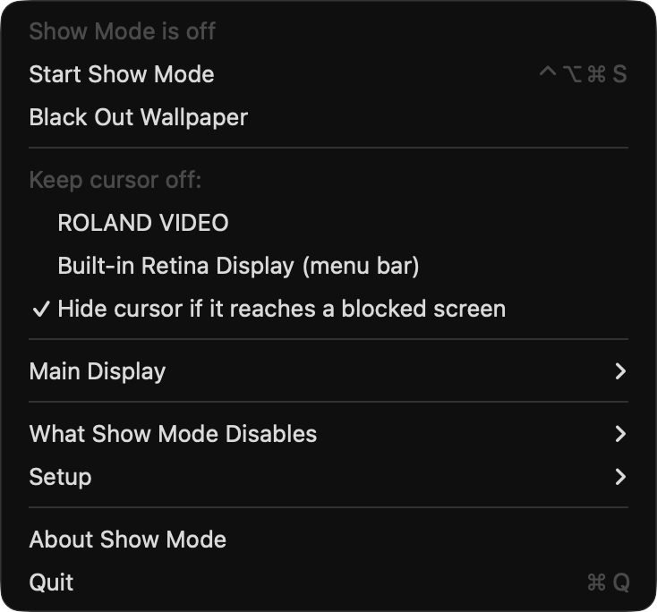

# Show Mode

A macOS menu-bar app that locks a presentation or playback Mac down for a show, then puts
every setting back exactly as it was.

**⌃⌥⌘S** starts/ends show mode · **⌃⌥⌘F** pauses the cursor fence (to reach a show screen deliberately)

> **Beta.** The power, screen-saver, hot-corner, Mission Control, True Tone and Night Shift
> guards and every restore path were run end to end on macOS 26.4, and the cursor fence and
> display lock on a real second display. The Do Not Disturb shortcuts have not been run —
> try it on the show machine first. Full details in the [user guide](docs/USER-GUIDE.md).



<!-- downloads:start -->

## Download

**[v0.2.0](https://github.com/stoatworks-labs/showmode/releases/tag/v0.2.0)** — prebuilt for macOS. Pick your platform:

<details>
<summary><b>macOS</b> — Universal (Apple Silicon + Intel)</summary>

| Build | Download | Size |
| --- | --- | --- |
| Universal (Apple Silicon + Intel) · .dmg disk image | [`showmode-0.2.0-macos-universal.dmg`](https://github.com/stoatworks-labs/showmode/releases/download/v0.2.0/showmode-0.2.0-macos-universal.dmg) | 314 KB |

</details>

All builds, checksums and release notes: [github.com/stoatworks-labs/showmode/releases](https://github.com/stoatworks-labs/showmode/releases).

macOS builds are signed and notarised by Apple, so they open normally — no Gatekeeper warning and no quarantine step.

<!-- downloads:end -->

| Guard | How |
|---|---|
| Display & system idle sleep | IOKit power assertions (die with the process) |
| Lid-close sleep *(off by default)* | `pmset disablesleep 1` — admin prompt |
| Low Power Mode | `pmset <source> powermode/lowpowermode 0`, per power source — admin prompt, only if it is on |
| Screen saver | `com.apple.screensaver idleTime 0` (current host) |
| Hot corners | all four `wvous-*` set to no-op, Dock restarted |
| Mission Control / App Exposé / gestures | `mcx-expose-disabled`, the four Dock gesture keys, Dock restarted |
| Click wallpaper to show desktop | `com.apple.WindowManager EnableStandardClickToShowDesktop` |
| Desktop wallpaper | black on every screen (and any plugged in mid-show); the WallpaperAgent store is copied and put back, so dynamic/aerial wallpapers and every Space return exactly |
| Notifications | Do Not Disturb via two generated Shortcuts (see below) |
| Night Shift | CoreBrightness `CBBlueLightClient` — disabled *and* its schedule cleared |
| True Tone | CoreBrightness `CBTrueToneClient` |
| Auto light/dark appearance | pins the current appearance (best effort) |
| Colour-shift apps | quits f.lux, Shifty, Lunar; relaunches them after |
| Cursor fence | keeps the cursor off the screens you tick |
| Display arrangement | keeps the chosen (or starting) main display main, and splits any screen that starts mirroring mid-show back to extended |

## Cursor fence

Tick the show screens under **Keep cursor off**. With Accessibility granted, an event tap
rewrites any mouse move that would land on one to the nearest point on an allowed screen, so the
cursor never gets in. Without it, a 120 Hz poll warps it back, and the cursor is hidden while it
is near a blocked screen so the crossing is never drawn. The menu will not let you block the
last unblocked screen (so a single-display Mac cannot be fenced at all), and blocking the main
display — the menu bar and Dock — asks first. If every screen still ends up blocked, or the only
allowed one is unplugged, the fence stands down rather than trap the cursor.

Screens are remembered by vendor/model/serial, so the choice survives replugging and reboots.

## Display arrangement

The main display is made main by moving it to the origin of the global display space
(`CGConfigureDisplayOrigin`, every display shifted by the same amount, so the arrangement is
kept). A reconfiguration callback, debounced by a second, re-applies it and splits new mirrors
(`CGConfigureDisplayMirrorOfDisplay(…, kCGNullDirectDisplay)`); displays already mirrored at
start are left alone. Four corrections in twenty seconds and it stops. The previous main
display is journalled and restored. Activity goes to `~/Library/Logs/ShowMode.log`.

## Notifications

macOS has no public Focus API. **Setup → Install Do Not Disturb shortcuts** generates and signs
"Show Mode Focus On/Off" (one *Set Focus* action each); Shortcuts asks you to add them once. After
that show mode runs them with `shortcuts run`.

## Restoring

Every change is journalled (`~/Library/Application Support/ShowMode/journal.plist`) *before* it
is made, with the value it replaced, and restore undoes only what show mode changed. Ending show
mode, quitting, SIGTERM/SIGINT/SIGHUP and relaunching after a crash all restore.

## Automation

`open showmode://on` · `off` · `toggle` · `fence-on` · `fence-off` · `wallpaper-black` ·
`wallpaper-restore` — e.g. from Companion or a
show-control script. `ShowMode --status` prints what it sees (read-only).

## Build

```bash
scripts/build-app.sh
```

This codebase was created with AI assistance, directed and reviewed by a human author.

Universal `dist/Show Mode.app`, Developer ID–signed when that identity is in the keychain (a
stable signature keeps the Accessibility grant across rebuilds).
